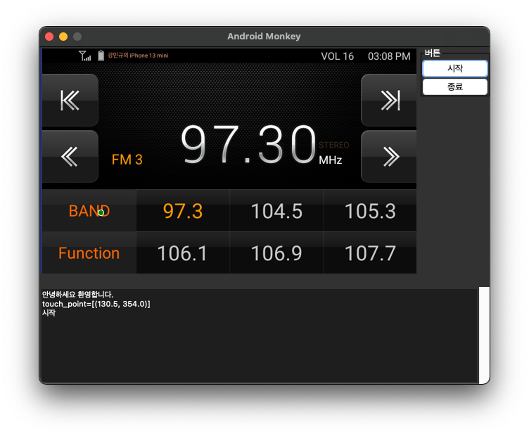
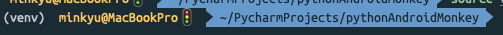
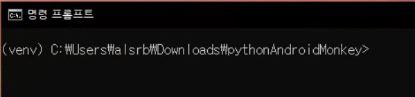

# pythonAndroidMonkey
Android ADB UI Monkey Test Program

## 프로그램 실행 화면

## 실행 파일 만들기 (윈도우: .exe)

### 사전 설정

- python 3.9 이하 설치된 상태
- ADB모드 상태
- PC와 USB 케이블 연결된 상태

### 가상환경 설정

    python -m venv venv

#### Mac OS

    source venv/bin/activate

#### Windows OS

    venv\Scripts\activate.bat

### 패키지 설치

    pip install -r requirements.txt

### 프로그램 실행

    python main.py

### .exe 파일 생성

    pyinstaller -F --noconsole main.py

/dist 경로에 main.exe 생성됨.

## 사용법

- 프로그램 실행 후 화면 터치하여 좌표 설정
- 클릭 간 주기 입력
- 한 cycle 반복 횟수 입력
- '시작' 버튼 눌러 좌표 설정한 순서대로 tap 수행
- '종료' 버튼 눌러 동작 중지
- 초기화하려면 재시작
