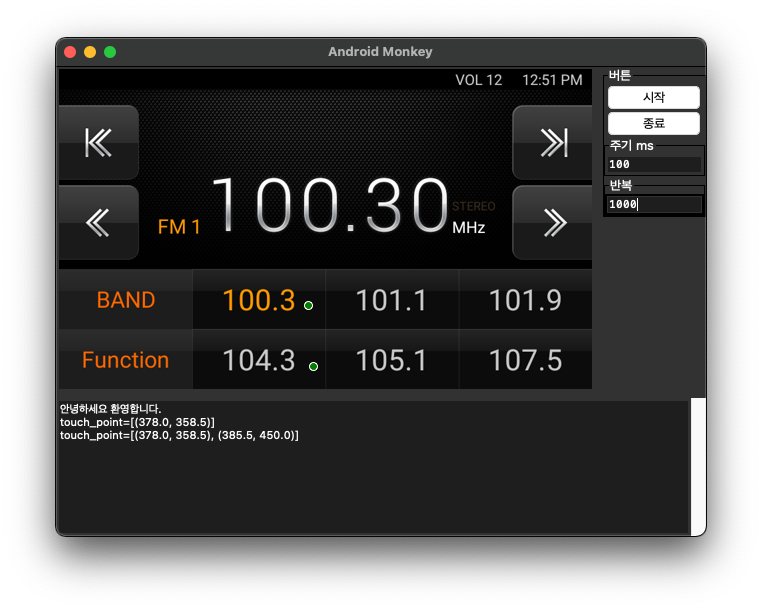

# pythonAndroidMonkey
Android ADB UI Monkey Test Program

## 프로그램 실행 화면

## 실행

### 사전 설정

- ADB모드 상태
- PC와 USB 케이블 연결된 상태

### 가상환경 설정

    python -m venv venv

### pip upgrade

#### Mac OS

    ./venv/bin/pip install --upgrade pip

#### Windows OS

    ./venv/Scripts/pip install --upgrade pip

### pillow 설치

#### Mac OS

    ./venv/bin/pip install pillow

#### Windows OS

    ./venv/Scripts/pip install pillow

### 프로그램 실행

#### Mac OS

    ./venv/bin/python main.py

#### Windows OS

    ./venv/Scripts/python main.py

## 사용법

- 프로그램 실행 후 화면 터치하여 좌표 설정
- '시작' 버튼 눌러 좌표 설정한 순서대로 500ms마다 tap 수행
- '종료' 버튼 눌러 동작 중지
